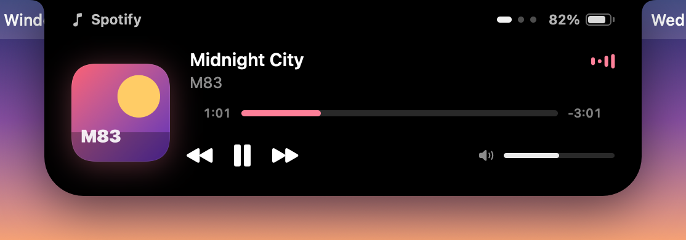
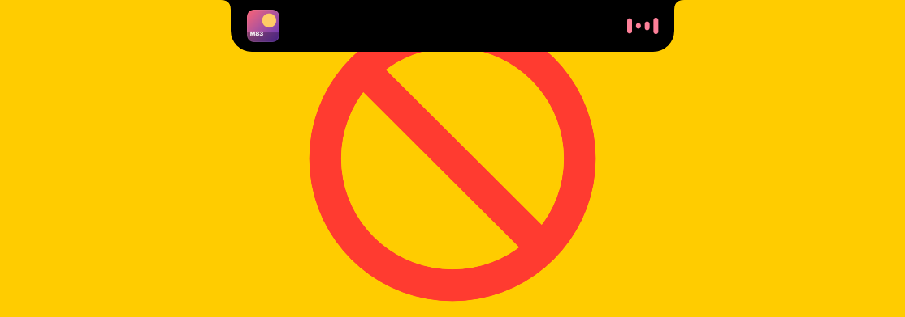
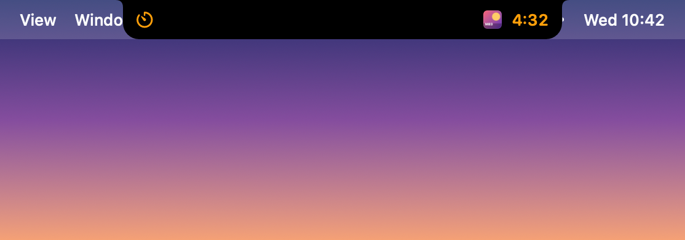
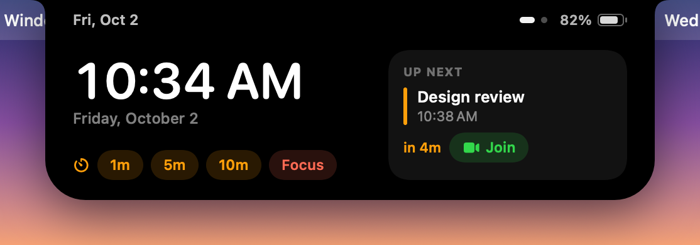

# Notchy

A Dynamic Island for the Mac notch, in the spirit of [Alcove](https://tryalcove.com). Native Swift and SwiftUI, one small menu bar app, no accounts, no network, no telemetry.



| Compact live activity | Two activities at once | Home |
|---|---|---|
|  |  |  |

All states: [notched display](docs/screenshots/sheet-notch.png) · [display without a notch](docs/screenshots/sheet-nonotch.png) · open animation [frame by frame](docs/screenshots/filmstrip-open.png) · [close](docs/screenshots/filmstrip-close.png)

## What it does

- **Invisible until needed.** When nothing is happening the island is exactly the size and position of the notch, pure black, so you cannot see it.
- **Live activities beside the notch.** Music shows the album art on the left and an equaliser tinted with the artwork's colour on the right. A running timer, an imminent meeting, a volume change or plugging in the charger all take the same two "wings".
- **One priority queue, like iOS.** The most important activity owns the wings; others shrink to a small glyph next to it. Swipe sideways on the island to bring another one to the front.
- **Expands on hover, click or swipe down.** Album art, title, a scrubbable progress bar, previous / play-pause / next, and a volume slider. Swipe sideways between pages: Now Playing, Timer, Up Next, and Home (clock, next event, one-click timers).
- **Moves like the iPhone island.** The shape is one animatable outline (width, height, bottom corners and the small concave "ears" that fuse it into the bezel) driven by springs. Content fades in with a blur a beat after the shape starts, and leaves before it shrinks. Reversing mid-animation never snaps.
- **Stays out of the way.** The window never takes focus, clicks outside the island go straight through to the menu bar and other apps, sweeping the pointer across the notch to reach the menu bar does not open it, and it is hidden from screen sharing by default.

### Activities

| Activity | Compact | Expanded | Source |
|---|---|---|---|
| Now Playing | art · equaliser | art, title, artist, scrubber, controls, volume, source app | Any app that reports to macOS Now Playing (Music, Spotify, Safari, Chrome, …) via the bundled [mediaremote-adapter](https://github.com/ungive/mediaremote-adapter). Falls back to Music and Spotify only if macOS blocks it. |
| Timer | ⏱ · countdown | ring, countdown, +1 min, pause, cancel | Built in. Plays a sound, pops open and fades away when done. |
| Calendar | 📅 · "in 4m" | next three events with **Join** for Zoom / Meet / Teams / Webex links | EventKit. Counts down from 15 min, alerts at 5 min. |
| Battery | ⚡ Charging · 76% | – | IOKit power-source notifications (no polling). Also warns at 20% and 10%. |
| Volume HUD | 🔊 · level | – | Replaces the system volume HUD (opt-in, needs Accessibility). |

## Install

### Build it (recommended)

Needs macOS 14 or later and Xcode 16 or later (the Command Line Tools are enough for a single-architecture build).

```sh
git clone https://github.com/samidun26/dynamic-island-mac.git
cd dynamic-island-mac
./build.sh                # or UNIVERSAL=1 ./build.sh for arm64 + x86_64
open build/Notchy.app     # or move it to /Applications first
```

### Or download a CI build

Every push builds a universal, ad-hoc signed `Notchy.app` (the **Notchy-app** artifact on the [Actions tab](https://github.com/samidun26/dynamic-island-mac/actions)). Because it is not notarized, macOS quarantines it when downloaded. After unzipping:

```sh
xattr -dr com.apple.quarantine Notchy.app
```

## Using it

| Do this | To |
|---|---|
| Rest the pointer on the notch | open (after ~120 ms; a quick pass does nothing) |
| Move away | close (after ~250 ms) |
| Click the island | open and keep it open until you click elsewhere |
| Two-finger swipe down / up on it | open / close |
| Two-finger swipe left / right on it | next / previous page (open), or next activity (compact) |
| Menu bar icon | open, start a timer, settings, quit |
| `open "notchy://timer?minutes=5"` | start a timer from Terminal, scripts or the Shortcuts "Open URLs" action. Also `notchy://timer?seconds=90`, `notchy://timer/cancel`, `notchy://open`, `notchy://settings` |

If you hide the menu bar icon, open Notchy again from Finder or Spotlight to get Settings back.

### Permissions (all optional, asked only when needed)

| Permission | Asked when | Used for |
|---|---|---|
| Calendars | Calendar activity is on (default) | Reading upcoming events. |
| Accessibility | You turn on the volume HUD | Intercepting the volume keys so the system HUD does not appear. |
| Automation (Music / Spotify) | Only if the Now Playing bridge is unavailable | Artwork, playhead and controls in the fallback mode. |

## Settings

General: hover to open (or click only, with a hover nudge), hover delay, haptics, hide from screen sharing, which display (built-in, main, or the one with the pointer), what to do on displays without a notch (show only when active, always as a fake notch, never), launch at login, menu bar icon.
Activities: each one on or off, track-change peek, timer sound, calendar access, volume HUD and experimental brightness keys.
Motion: open and close spring response and damping, with a Preview button. Defaults: open 0.42 s / 0.80, close 0.36 s / 0.90.

## How it works

```
Sources/
  NotchyCore/            plain Foundation, unit tested
    NotchMetrics.swift     notch geometry from NSScreen values; every state's size; hit rects
    Activities.swift       IslandState, ActivityQueue (priority, transients, swipe preference, pages)
    HoverIntent.swift      dwell / pass-through / close-delay logic
    NowPlaying.swift       adapter stream parser (full payloads + diffs), playhead interpolation
    Utilities.swift        notchy:// links, meeting-link finder, spring curve, artwork tint
  Notchy/
    Island/IslandPanel.swift   fixed NSPanel, click-through, mouse monitors, swipes, screens
    Island/IslandShape.swift   the outline (flat top, concave ears, convex corners), one animatableData
    Island/IslandModel.swift   derives state + geometry and commits it in one spring transaction
    Island/IslandView.swift    canvas, compact wings, expanded header + page carousel
    Island/Components.swift    artwork, equaliser, scrubber, sliders, buttons, transitions
    Activities/ActivityViews.swift
    Services/                  NowPlaying, Timer, Battery, Calendar, HUD
    Settings/                  preferences and the Settings window
    App/                       entry point, menu bar, demo scenarios and snapshot renderer
Vendor/mediaremote-adapter/  BSD-3, compiled by build.sh
```

Design rules the code follows:

- **The window never moves or resizes while animating.** One transparent panel, sized once for the largest state, pinned to the top centre of the screen. Only the SwiftUI shape inside it animates, so there is no window-resize jank.
- **Click-through by toggling `ignoresMouseEvents`** from the island's current hit rect on every mouse move (global + local monitors). Hover, clicks and swipes therefore work even though the app is never active.
- **One source of truth.** Activities and interaction are plain observed inputs; `IslandModel.refresh()` derives the presentation and commits it inside a single `withAnimation(spring)`, so the outline, its clip and the content transitions can never disagree.
- **No idle work.** No timers run when nothing is shown: countdowns use `Text(timerInterval:)`, the equaliser and progress bar use `TimelineView`s that only exist while visible, the calendar sleeps until the next event boundary, battery and media are push-based.

## Verified, untested, and not possible

Built and checked on GitHub's macOS runners (see `.github/workflows/build.yml`):

- Compiles in Swift 6 language mode; core unit tests pass (geometry, priority queue, hover intent, stream parsing, links).
- `build.sh` produces a universal, signed `.app`; `codesign --verify --deep --strict` passes.
- The bundled adapter loads under `/usr/bin/perl` on the runner and answers (`get` returns `null` when nothing plays).
- Every state renders (the screenshots above are produced by `Notchy --snapshot` on CI).
- Idle process: 0.0% CPU, about 10 MB memory (`top` on the runner, demo idle state).

Not verified, because it needs real hardware and a person:

- Pixel alignment over a real notch. The geometry comes from `NSScreen.safeAreaInsets` and `auxiliaryTopLeftArea/RightArea`, and the CI screenshots use 14" MacBook Pro values, but the runners have no notch.
- Hover, click, swipe and haptics feel; the springs were tuned by reasoning and rendered frames, not by hand on a trackpad.
- Real playback through the adapter (no audio on CI), the Music/Spotify fallback, calendar permission prompts, the Accessibility flow and media keys, charging events.
- Multi-display hot-plug and full-screen Spaces.

Not possible or deliberately not done:

- **Focus / Do Not Disturb.** No public API reports the current Focus to a non-sandboxed app. `INFocusStatusCenter` only gives a yes/no to apps with a provisioned Communication Notifications entitlement, and reading `~/Library/DoNotDisturb` needs Full Disk Access and is undocumented. Not implemented.
- **Showing other apps' notifications** in the island. That needs private APIs or reading the notification database. Stretch goal, not implemented: high breakage risk and not App Store eligible.
- **Lock screen widgets.** Drawing over the lock screen needs private SkyLight/CGS window-level hacks. Not implemented, for the same reasons.
- **Brightness keys** have no public API on Apple silicon. The "Brightness keys too" switch uses the private DisplayServices framework; it is off by default and labelled experimental. **Keyboard backlight** keys are left to macOS.
- **The system HUD can only be hidden while Notchy consumes the key.** If Accessibility is not granted, or the output device has no software volume (some HDMI/USB devices), the key is passed through and macOS shows its own HUD.
- **Now Playing on macOS 15.4+** depends on mediaremote-adapter's use of the Apple-signed `/usr/bin/perl`. Apple could close that; Notchy then falls back to Music and Spotify.
- **App Intents / Spotlight actions** are not included: Shortcuts only discovers intents from metadata Xcode extracts at build time, which a SwiftPM build does not run. Use the `notchy://` URLs from Shortcuts' "Open URLs" action instead.
- **Hidden from screen sharing** uses `NSWindow.sharingType = .none`; some capture tools ignore it.

## Development

```sh
swift build && swift test                     # core logic tests (also run on Linux)
.build/debug/Notchy --demo expanded           # live panel with fake data: idle, compact, expanded, peek,
                                              # multi, timer, timerExpanded, hud, battery, calendar,
                                              # calendarExpanded, home
.build/debug/Notchy --snapshot /tmp/shots     # render every state + animation filmstrips to PNG
```

CI renders the snapshots on every push. To refresh the images in `docs/screenshots`, run the **build** workflow manually with "publish snapshots" ticked.

### Signing for distribution

`SIGN_IDENTITY="Developer ID Application: Your Name (TEAMID)" ./build.sh` signs with the hardened runtime and `Resources/Notchy.entitlements` (Apple Events and Calendars). Then notarize:

```sh
ditto -c -k --keepParent build/Notchy.app Notchy.zip
xcrun notarytool submit Notchy.zip --keychain-profile <profile> --wait
xcrun stapler staple build/Notchy.app
```

## Credits

- [mediaremote-adapter](https://github.com/ungive/mediaremote-adapter) by Jonas van den Berg and contributors, BSD 3-Clause. Vendored in `Vendor/mediaremote-adapter` with its license; also shown in Settings → About.
- Inspired by Alcove and the iPhone Dynamic Island. No code, assets or copy from Alcove, boring.notch or other notch apps are used.
